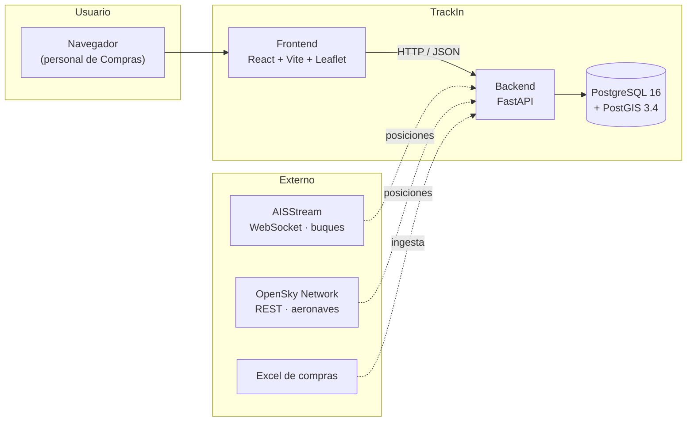

# Arquitectura

> **Estado: pendiente.** Se completa en **Sprint 2**, una vez cerrado el
> análisis de requerimientos. Lo que sigue es la arquitectura tentativa
> definida en el anteproyecto: sirve de punto de partida, no de decisión final.

## Vista general (tentativa)

## Decisiones a documentar en Sprint 2

- [ ] Diagrama de componentes definitivo
- [ ] Diagrama de despliegue (dónde corre cada pieza en Gutis)
- [ ] Estrategia de ingesta de posiciones: ¿worker aparte o tareas en background
      dentro del proceso de la API?
- [ ] Frecuencia de muestreo y política de retención del histórico de posiciones
      (define el volumen de la tabla más grande del sistema)
- [ ] Manejo de reconexión del WebSocket de AISStream
- [ ] Autenticación y autorización: ¿integración con el directorio de Gutis?
- [ ] Estrategia de caché para no exceder los límites de las APIs externas

## Notas de contexto

- **Por qué PostGIS:** los pedidos se ubican geográficamente y las consultas
  del dashboard son espaciales (cercanía a puerto, distancia a destino,
  desvío de ruta). Resolverlo en la base evita traer todo a memoria.
- **Por qué async en el backend:** el tracking marítimo llega por WebSocket y
  el aéreo por polling HTTP; ambos son I/O-bound, no CPU-bound.

## Referencias

- [docs/data-model.md](data-model.md) — modelo de datos
- [docs/api-references.md](api-references.md) — contratos de las APIs externas
