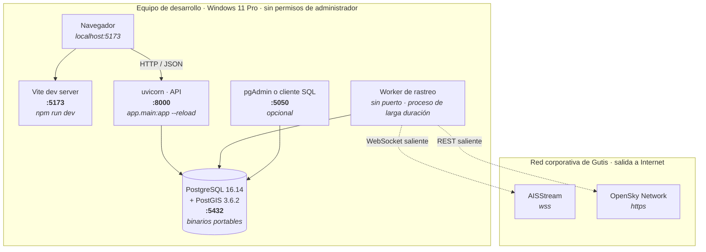
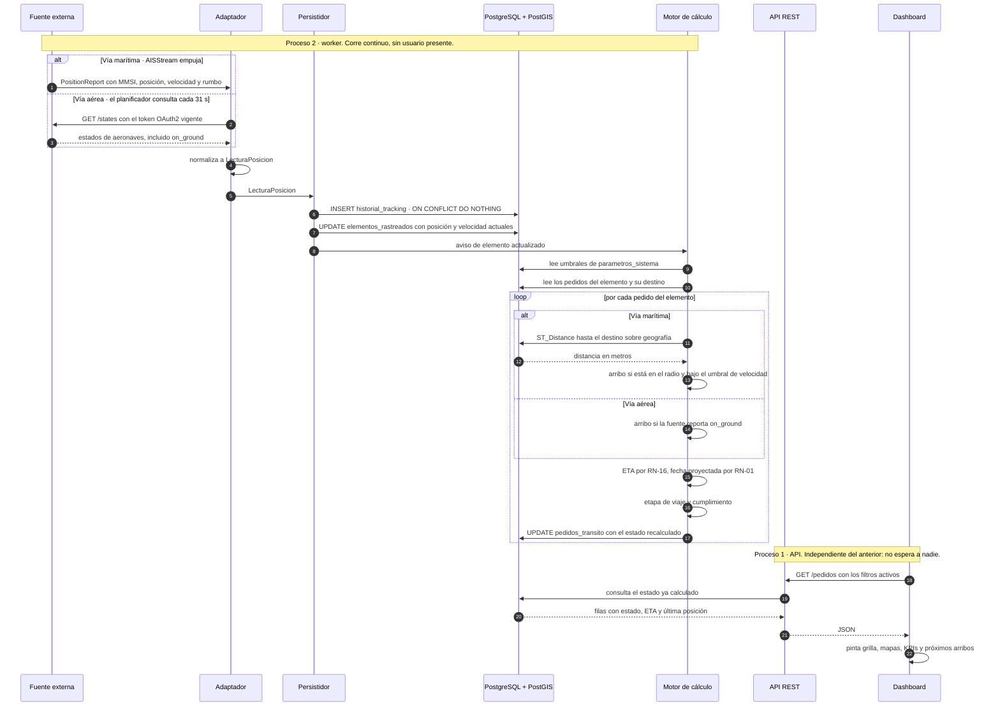

# Arquitectura

Arquitectura definitiva de TrackIn. Sustituye a la vista tentativa del
anteproyecto, que enrutaba la ingesta desde un Excel de compras —vía que el SRS
v0.2 eliminó— y dejaba sin decidir dónde corren los procesos de rastreo.

**Fuente normativa:** SRS v0.3 §5.8 (stack), §7 (reglas), los requerimientos no
funcionales RNF-03, RNF-12, RNF-14, RNF-19 a RNF-21, y las mediciones de los
spikes TG-10 y TG-11.

## Estado

| Vista | Tarea | Estado |
|---|---|---|
| Componentes | `TASK-20` | ✅ 25/08/2026 |
| Despliegue (instalación nativa) | `TASK-21` | ✅ 25/08/2026 |
| Secuencia (flujo de tracking) | `TASK-22` | ✅ 25/08/2026 |

---

## 1. Vista de componentes

### 1.1 Diagrama

```mermaid
flowchart TB
    subgraph cliente["Navegador"]
        SPA["SPA React 19<br/>Vite · TypeScript · Tailwind · Leaflet<br/><i>grilla, mapas, KPIs</i>"]
    end

    subgraph api["Proceso 1 — API · uvicorn app.main:app"]
        REST["Routers REST<br/><i>pedidos, detalle, maestros</i>"]
        SVC["Servicios de lectura<br/><i>solo consulta estado ya calculado</i>"]
    end

    subgraph worker["Proceso 2 — Worker · python -m app.workers"]
        SCHED["Planificador<br/><i>frecuencia parametrizable</i>"]
        AISC["Adaptador AISStream<br/><i>WebSocket persistente</i>"]
        OSKC["Adaptador OpenSky<br/><i>REST + OAuth2</i>"]
        NORM["Puerto FuenteRastreo<br/><b>normaliza a LecturaPosicion</b>"]
        PERS["Persistidor de lecturas<br/><i>idempotente</i>"]
        CALC["Motor de cálculo<br/><i>ETA, fecha proyectada, estado</i>"]
        INGE["Adaptador de ingesta de pedidos<br/><i>semilla · SAP pendiente</i>"]
    end

    subgraph datos["PostgreSQL 16 + PostGIS 3.4"]
        DB[("10 tablas<br/><i>elementos_rastreados · historial_tracking<br/>pedidos_transito · parametros_sistema</i>")]
    end

    subgraph externo["Fuentes externas"]
        AIS["AISStream<br/><i>push · buques</i>"]
        OSN["OpenSky Network<br/><i>pull · aeronaves</i>"]
        SAP["Servicio API de SAP<br/><i>sin fecha</i>"]
    end

    SPA -->|"HTTP / JSON"| REST
    REST --> SVC
    SVC -->|"solo lectura"| DB

    AIS -.->|"mensajes AIS"| AISC
    OSN -.->|"consulta cada 31 s"| OSKC
    SAP -.->|"bloqueado"| INGE

    SCHED --> OSKC
    AISC --> NORM
    OSKC --> NORM
    NORM --> PERS
    PERS --> DB
    PERS --> CALC
    CALC --> DB
    INGE --> DB
    DB -->|"parámetros y umbrales"| CALC
```

### 1.2 Responsabilidad de cada componente

| Componente | Responsabilidad | Lo que **no** hace |
|---|---|---|
| **SPA React** | Presenta grilla, mapas y KPIs; aplica filtros de forma transversal | No calcula estados ni consulta fuentes externas |
| **Routers REST** | Exponen pedidos, detalle y maestros; publican OpenAPI (`TASK-04`) | **Nunca llaman a una API externa** |
| **Servicios de lectura** | Consultan el estado ya calculado y lo componen para la vista | No escriben en `historial_tracking` |
| **Planificador** | Dispara la consulta ADS-B con la frecuencia de `parametros_sistema` | No decide qué hacer con la lectura |
| **Adaptador AISStream** | Mantiene la suscripción WebSocket, reconecta con backoff, vigila el canal con ping/pong | No interpreta el estado logístico |
| **Adaptador OpenSky** | Consulta por REST, renueva el token OAuth2 antes de que expire | No interpreta el estado logístico |
| **Puerto `FuenteRastreo`** | Normaliza ambos orígenes a un tipo único de lectura | No persiste |
| **Persistidor** | Escribe la lectura en `historial_tracking` y refresca `posicion_actual` | No calcula |
| **Motor de cálculo** | Aplica RN-01 y RN-05 a RN-16: ETA, fecha proyectada, geocerca, estado | No habla con fuentes externas |
| **Adaptador de ingesta** | Da de alta pedidos desde datos semilla; mañana desde SAP | No rastrea |
| **PostgreSQL + PostGIS** | Persiste y resuelve las distancias con `ST_Distance` sobre geografía | — |

### 1.3 El puerto común de fuentes — RNF-21

RNF-21 exige *«incorporar nuevas fuentes de rastreo sin alterar la lógica de
cálculo de estados, aislando cada integración tras una interfaz común»*. El
problema es que las dos fuentes tienen modelos opuestos:

| | AISStream | OpenSky |
|---|---|---|
| Modelo | **Push**: suscripción persistente, el servidor empuja | **Pull**: se consulta cada 31 s |
| Cadencia | Cuando el buque transmite; mediana 62 s | La que fije el planificador |
| Autenticación | API key en el mensaje de suscripción | OAuth2, token de 30 min |
| Fallo típico | La conexión se cae sin cierre limpio | La aeronave desaparece del listado sin motivo |

**No se pueden unificar por la entrada, así que se unifican por la salida.**
Ambos adaptadores producen el mismo tipo —`LecturaPosicion`: elemento,
instante, posición, velocidad, rumbo, estado crudo y payload íntegro— y lo
entregan al persistidor. Aguas abajo del puerto, nada sabe si el dato vino de un
socket o de una consulta.

Añadir una tercera fuente —un proveedor AIS de pago con cobertura de Moín, que
es la decisión abierta #3 del backlog— significa escribir un adaptador nuevo y
no tocar el motor de cálculo.

### 1.4 Decisión: el rastreo corre en un proceso aparte, no dentro de la API

Es la pregunta que el anteproyecto dejó abierta: *«¿worker aparte o tareas en
background dentro del proceso de la API?»*. **Worker aparte**, por cuatro
razones, la primera de ellas específica de este proyecto:

1. **`--reload` mataría la suscripción AIS en cada guardado.** El entorno de
   desarrollo arranca con `uvicorn app.main:app --reload`, tal como documenta
   `backend/app/main.py`. Cada vez que se guarda un archivo, uvicorn reinicia el
   proceso. Con el colector dentro, cada pulsación de guardar cerraría y
   reabriría el WebSocket. Y eso no es solo molesto: el riesgo R1 sospecha que
   la cuenta de AISStream topó un límite del plan gratuito, así que reconectar
   decenas de veces por día es exactamente lo que no conviene hacer.
2. **Aislamiento de fallos (RNF-14).** Un error en el bucle de reconexión no
   debe tumbar la API. Con procesos separados, el dashboard sigue sirviendo el
   último dato conocido aunque el colector esté caído — que es literalmente lo
   que pide RNF-12.
3. **Ciclos de vida distintos.** La API es *request/response* y puede reiniciarse
   sin consecuencias; el colector AIS es un proceso de larga duración cuyo valor
   está en no interrumpirse.
4. **RNF-03 lo empuja igual.** Los spikes midieron 780–915 ms por consulta ADS-B
   y ~1000 ms para obtener el token, contra un techo de 3 s para toda la vista
   (RNF-01). Las consultas externas no caben en el ciclo de petición.

**Sin broker de mensajes.** No hay Celery, ni Redis, ni RabbitMQ: el worker es un
proceso con su propio bucle asíncrono y la base de datos es el único estado
compartido. Meter un broker obligaría a instalar y documentar un servicio más en
una máquina que ni siquiera puede correr Docker (RNF-19), a cambio de una
capacidad —distribuir tareas entre nodos— que este sistema no necesita.

**El costo:** en desarrollo hay que levantar dos procesos. Se documenta en
`TASK-21` y en el manual de instalación de `TASK-07`.

### 1.5 Cómo se sostiene la degradación — RNF-12 y RNF-14

La regla que hace posible degradar es que **la API nunca depende de una fuente
externa para responder**. Todo lo que el dashboard muestra ya está en la base:
`elementos_rastreados.posicion_actual`, `ultima_actualizacion_api` y
`pedidos_transito.estado_calculado`.

En consecuencia:

- Si AISStream se cae, el dashboard sigue respondiendo con la última posición
  conocida y su antigüedad, que es lo que exige RNF-12.
- El indicador de frescura del encabezado muestra **cada fuente por separado**,
  porque se caen por separado.
- El spike TG-11 midió que cerca del **8 % de las aeronaves desaparece del
  listado entre dos muestras** separadas 60 segundos, sin que la fuente indique
  el motivo. El sistema conserva la última posición con su marca temporal en vez
  de afirmar un estado que no consta.
- El motor procesa pedido por pedido y aísla el fallo de uno (RNF-14): una
  lectura corrupta de un buque no interrumpe el recálculo de los demás.

### 1.6 Decisiones clave que la arquitectura registra

| Decisión | Qué implica en los componentes |
|---|---|
| **Arribo por geocerca más confirmación manual** (RN-05, RN-14) | El motor de cálculo infiere el arribo con `ST_Distance` y el umbral de velocidad; el arribo así obtenido se marca **inferido**. La confirmación manual de Logística entra por la API y **prevalece** sobre lo inferido |
| **Arribo aéreo por `on_ground`, no por geocerca** (decisión del 25/08) | El motor aplica criterios distintos por vía: geometría para lo marítimo, indicador de la fuente para lo aéreo |
| **Carga de pedidos por datos semilla** (`TASK-03`) | El adaptador de ingesta existe desde el Sprint 3 con semilla. **No es una función de usuario**: es un habilitador. El adaptador de SAP se enchufa después en el mismo puerto |
| **Sin autenticación en la práctica** (decisión del 25/08) | No hay componente de identidad en el alcance. La entidad `usuarios` existe igual, porque RF-14 la necesita para la auditoría. La costura queda: el control de acceso se antepone a los routers cuando el Centro de Competencias lo implemente |
| **Parámetros fuera del código** (RNF-07, RNF-15) | El motor lee umbrales y frecuencias de `parametros_sistema` en cada ciclo, no de constantes |

### 1.7 Puntos abiertos que deja `TASK-20`

| # | Punto | Quién decide | Cuándo |
|---|---|---|---|
| 1 | ¿El worker es un proceso único con dos bucles, o un proceso por fuente? | Implementación | `US-02` / `US-05`, Sprint 3-4 |
| 2 | Cómo se supervisa el worker en producción (reinicio ante caída) | Centro de Competencias | `TASK-09`, cierre |
| 3 | Si se compra una fuente AIS con cobertura de Moín, ¿reemplaza o convive con AISStream? | Greivin / Compras | Sin fecha |

---

## 2. Vista de despliegue — desarrollo, instalación nativa

**Alcance:** solo el entorno de desarrollo. **La producción queda fuera del
alcance de la práctica** (SRS §9.1): el despliegue en servidor lo ejecuta el
Centro de Competencias, y los artefactos que necesita —`docker-compose.yml`, los
`Dockerfile` y la guía de `TASK-09`— se conservan sin usarse aquí.

### 2.1 Diagrama

### 2.2 Procesos y puertos

| Proceso | Puerto | Cómo se levanta | Arranca solo |
|---|---|---|---|
| PostgreSQL + PostGIS | `5432` | `pg_ctl -D ~/pgsql/data start` | **No** |
| API | `8000` | `uvicorn app.main:app --reload` desde el `.venv` de `backend/` | No |
| **Worker de rastreo** | — | `python -m app.workers` desde el mismo `.venv` | No |
| Frontend | `5173` | `npm run dev` | No |
| pgAdmin | `5050` | Opcional; sirve cualquier cliente SQL | No |

**Ninguno arranca solo, y no es un descuido.** Sin permisos de administrador no
se puede registrar PostgreSQL como servicio de Windows, así que hay que
levantarlo a mano en cada sesión de trabajo. Lo mismo aplica al resto.

### 2.3 Por qué nativo y no contenedores

Docker Desktop 4.85 **está instalado** pero no puede correr: en Windows todo
runtime de contenedores Linux depende de WSL2 o Hyper-V, ambas características
que solo se habilitan con permisos de administrador. TI no pudo habilitarlas y
no hay alternativa en espacio de usuario. El SRS §9.3 recoge que el supervisor
aceptó prescindir de contenedores.

El detalle de instalación —origen de los binarios portables, `initdb -E UTF8
--locale=C` para que el ordenamiento de índices coincida con el del contenedor,
y el bundle de PostGIS que se descomprime encima de PostgreSQL— está en
[`deployment.md`](deployment.md) §«Entorno de desarrollo sin Docker» y no se
repite aquí.

### 2.4 Dependencias del equipo

| Runtime | Versión | Dónde |
|---|---|---|
| Python | 3.12 | `%LOCALAPPDATA%\Programs\Python\Python312` |
| Node.js + npm | 24 LTS | `%LOCALAPPDATA%\Programs\nodejs` |
| PostgreSQL + PostGIS | 16.14 / 3.6.2 | `~\pgsql`, binarios portables |

Los tres se instalaron **en el ámbito del usuario**, sin elevación. RNF-19 exige
justamente que el entorno se levante en Windows con un procedimiento
documentado y reproducible.

> **Consecuencia de `TASK-20` sobre la documentación existente.** La tabla de
> `deployment.md` describe tres piezas —base, backend y frontend—. Con la
> decisión del worker aparte son **cuatro procesos**. Se corrige allí para que
> los dos documentos no se contradigan.

---

## 3. Vista de secuencia — flujo principal de tracking

### 3.1 Diagrama

### 3.2 Lo que el diagrama afirma y conviene no perder de vista

**Las dos mitades no se tocan.** El bloque de arriba corre en el worker sin que
haya nadie mirando; el de abajo ocurre cuando un usuario abre el dashboard. La
única cosa que comparten es la base. Eso es lo que hace cumplible RNF-03 —las
consultas externas fuera del ciclo de petición— y RNF-12 —el dashboard responde
aunque la fuente esté caída, con el último dato y su antigüedad—.

**La escritura es idempotente.** El `ON CONFLICT DO NOTHING` del paso de
persistencia es lo que permite que una reconexión de AISStream reenvíe mensajes
ya procesados sin ensuciar el historial ni el trayecto.

**El recálculo es por elemento, no por pedido.** Una sola lectura de un buque
actualiza de golpe todos los pedidos que viajan en él —el caso de las cinco
líneas de una misma OC—. El bucle procesa pedido por pedido para aislar el fallo
de uno, conforme a RNF-14.

**El criterio de arribo se bifurca por vía.** Geometría para lo marítimo,
`on_ground` para lo aéreo. Es la decisión del 25/08, y es el punto donde la
secuencia deja de ser simétrica entre las dos fuentes.

**La distancia la calcula la base, no Python.** `ST_Distance` sobre `GEOGRAPHY`
devuelve metros sobre el elipsoide, que es lo que RN-05 necesita para comparar
contra un radio en kilómetros.

### 3.3 Consistencia con la vista de componentes

Cada participante del diagrama corresponde a un componente de §1.2, con las
mismas responsabilidades y las mismas prohibiciones: el adaptador no interpreta
estados, el motor no habla con fuentes externas, y la API no llama a nadie de
afuera.

---

## Notas de contexto

- **Por qué PostGIS.** Las consultas del dashboard son espaciales —proximidad al
  puerto, distancia al destino— y RN-05 las compara contra un radio en
  kilómetros. Resolverlo en la base con `ST_Distance` sobre `GEOGRAPHY` evita
  traer posiciones a memoria y devuelve metros, no grados. RNF-20 acota la
  persistencia a PostgreSQL con PostGIS, sin recursos propietarios de nube.
- **Por qué asíncrono.** El tracking marítimo llega por WebSocket y el aéreo por
  *polling* HTTP: ambos son I/O-bound, no CPU-bound.
- **Por qué el dashboard no lee `historial_tracking`.** Esa tabla crece unos 25
  millones de filas al año (ver `data-model.md` §3.6). La última posición vive
  desnormalizada en `elementos_rastreados`, y es lo que hace compatibles RNF-01
  y RNF-22.

## Referencias

- [`data-model.md`](data-model.md) — modelo de datos y ER consolidado
- [`data-dictionary.md`](data-dictionary.md) — diccionario de datos
- [`api-references.md`](api-references.md) — contratos y hallazgos de las APIs externas
- [`deployment.md`](deployment.md) — entorno de ejecución
