# Modelo de datos

Modelo entidad-relación definitivo de TrackIn. Sustituye al modelo tentativo del
anteproyecto, que proponía siete entidades distintas de las que finalmente
identificó el análisis.

**Fuente normativa:** SRS v0.3, §8 (entidades y campos preliminares) y §7 (reglas
de negocio). Donde este documento se aparta de §8, lo dice explícitamente y
justifica por qué: el propio SRS declara §8 como *preliminar* y remite el modelo
definitivo a este archivo.

## Estado de avance

| Entidad | Tarea | Estado |
|---|---|---|
| `pedidos_transito` | `TASK-12` | ✅ Modelada — 24/08/2026 |
| `maestro_destinos` | `TASK-13` | ✅ Modelada — 25/08/2026 |
| `historial_tracking` | `TASK-14` | ✅ Modelada — 25/08/2026 |
| `elementos_rastreados` | `TASK-15` | ✅ Modelada — 25/08/2026 |
| `proveedores` | `TASK-15` | ✅ Modelada — 25/08/2026 |
| `materiales` | `TASK-15` | ✅ Modelada — 25/08/2026 |
| `usuarios` | `TASK-15` | ✅ Modelada — 25/08/2026 |
| `auditoria_intervenciones` | `TASK-15` | ✅ Aprobada — 25/08/2026 |
| `parametros_sistema` | `TASK-15` | ✅ Aprobada — 25/08/2026 |
| `pedido_elemento_rastreado` | `TASK-15` | ✅ Aprobada — 25/08/2026 |
| ER consolidado | `TASK-15` | ✅ Consolidado — 25/08/2026 |

El diccionario de datos formal —nulabilidad, dominios y descripciones campo por
campo— es un entregable aparte (`TASK-16` a `TASK-19` y `TASK-24`) derivado de
este modelo.

## Decisiones aprobadas — revisión con el supervisor, 25/08/2026

El modelo quedó **revisado y aprobado**. Las decisiones que estaban abiertas se
cerraron así (acta en [`backlog/agenda_revision_supervisor.md`](backlog/agenda_revision_supervisor.md)):

| Punto | Decisión | Efecto |
|---|---|---|
| Transbordo (§3.8) | **Se conserva el trayecto completo**: entra la entidad asociativa | El ER queda en **diez** entidades; `tramo` vive en la asociativa |
| Entidades de `TASK-01` (§8.4) | **Se actualiza el criterio a diez entidades** | `TASK-01` se reestima de 10 h a 14 h |
| Autenticación RNF-04 (§7.2) | **Fuera del alcance de la práctica**, documentado en el SRS | `usuarios` se construye igual, por RF-14 |
| Estado del pedido (§1.4) | **Dos columnas más una derivada** | Sin costo adicional; lo implementan `US-10` y `US-24` |
| Arribo aéreo (§2.5) | **`on_ground` para aéreo, geocerca para marítimo** | Simplifica `US-11` |
| Volumen del historial (§3.6) | **Intervalo mínimo configurable en `US-04`**; `TASK-10` se queda en el Sprint 7 | Es un parámetro, no una historia |
| `tracking_interno` (§1.2) | **Lo genera TrackIn** | Consumo de `TASK-03` |

---

## Convenciones

Ya implementadas en `backend/app/db/base.py`:

- **Nombres de constraints determinísticos** vía `naming_convention` de
  SQLAlchemy. Sin esto, Alembic genera migraciones cuyo `downgrade` no se
  puede aplicar porque desconoce los nombres que puso Postgres.
- **Geometrías en SRID 4326** (WGS84), que es el sistema en que reportan tanto
  AIS como OpenSky. Se usa `GEOGRAPHY` y no `GEOMETRY` para que los cálculos
  de distancia den metros sobre el elipsoide y no grados.
- **Timestamps en UTC** (`TIMESTAMP WITH TIME ZONE`). La conversión a hora de
  Costa Rica se hace en la capa de presentación.

Adoptadas en `TASK-12`:

- **Claves primarias sustitutas** (`BIGSERIAL`) en todas las entidades, con la
  clave natural declarada aparte como `UNIQUE`. Ver §1.2.
- **Dominios cerrados como `VARCHAR` + `CHECK`**, no como `ENUM` nativo de
  Postgres. Un `ENUM` exige `ALTER TYPE` para agregar un valor, lo que en
  Alembic obliga a migraciones no reversibles; un `CHECK` se reemplaza en un
  `downgrade` limpio. Los valores se escriben en mayúsculas sin tildes
  (`EN_TRANSITO`) para que el dato no dependa de la intercalación de la base.
- **Fechas puras como `DATE`, instantes como `TIMESTAMPTZ`.** `fecha_entrega_pedido`
  es un compromiso comercial sin hora; `ata_confirmada` es un instante.

---

## Diagrama ER consolidado

Las **siete** entidades del SRS v0.3 §8.1 más las **tres** que su articulado
exige pero su lista no enumera (§8). **Las diez quedaron aprobadas en la
revisión del 25/08.**

```mermaid
erDiagram
    MAESTRO_DESTINOS     ||--o{ PEDIDOS_TRANSITO : "es destino de"
    PROVEEDORES          ||--o{ PEDIDOS_TRANSITO : "suministra"
    MATERIALES           ||--o{ PEDIDOS_TRANSITO : "se pide como"
    ELEMENTOS_RASTREADOS |o--o{ PEDIDOS_TRANSITO : "transporta (vigente)"
    ELEMENTOS_RASTREADOS ||--o{ HISTORIAL_TRACKING : "reporta"
    PEDIDOS_TRANSITO     ||--o{ AUDITORIA_INTERVENCIONES : "registra"
    USUARIOS             ||--o{ AUDITORIA_INTERVENCIONES : "ejecuta"
    USUARIOS             ||--o{ PARAMETROS_SISTEMA : "modifica"
    PEDIDOS_TRANSITO     ||--o{ PEDIDO_ELEMENTO_RASTREADO : "recorre en"
    ELEMENTOS_RASTREADOS ||--o{ PEDIDO_ELEMENTO_RASTREADO : "cubre"

    PEDIDOS_TRANSITO {
        bigserial   id                          PK "clave sustituta"
        varchar     oc_numero                   UK "natural, con posicion_oc"
        integer     posicion_oc                 UK "natural, con oc_numero"
        varchar     tracking_interno            UK "clave alterna"
        bigint      id_proveedor                FK "NOT NULL"
        bigint      id_material                 FK "NOT NULL"
        bigint      id_destino                  FK "NOT NULL, compuesto con via"
        bigint      id_elemento_rastreado       FK "NULL = RN-02 Sin tracking"
        varchar     via_transporte                 "CHECK AEREO o MARITIMO"
        numeric     cantidad_pedida                "RN-10"
        varchar     unidad_medida                  "RN-10"
        date        fecha_entrega_pedido           "compromiso comercial"
        integer     lead_time_destino_dias         "snapshot, RN-01"
        integer     ajuste_manual_dias             "RN-01"
        timestamptz eta_utilizada                  "snapshot, RN-16"
        timestamptz ata_confirmada                 "manual, RN-14"
        date        fecha_proyectada_disponible    "NULL si ETA no estimable"
        varchar     etapa_viaje                    "CHECK, RN-02 a RN-06"
        varchar     estado_cumplimiento            "CHECK NULL, RN-07 a RN-09"
        varchar     estado_calculado               "CHECK, derivada, RF-11"
        timestamptz fecha_ultimo_recalculo         "US-23"
        timestamptz fecha_recepcion_planta         "RF-25"
        numeric     cantidad_recibida              "RN-10"
        varchar     motivo_cierre                  "CHECK NULL, RN-13"
        timestamptz creado_en
        timestamptz actualizado_en
    }

    MAESTRO_DESTINOS {
        bigserial   id                  PK "clave sustituta"
        varchar     codigo              UK "UN-LOCODE o ICAO"
        varchar     nombre                 "etiqueta legible"
        char        pais                   "ISO 3166-1 alfa-2"
        varchar     via_transporte         "CHECK, parte del FK compuesto"
        geography   ubicacion              "Point 4326, RN-05"
        integer     radio_geocerca_km      "NULL = usa parametro global"
        integer     lead_time_dias         "NOT NULL, RN-12"
        boolean     activo                 "baja logica"
        text        observacion
        timestamptz creado_en
        timestamptz actualizado_en
    }

    ELEMENTOS_RASTREADOS {
        bigserial   id                       PK
        varchar     tipo_tracking_externo    UK "unico solo si activo"
        varchar     tracking_externo         UK "MMSI, IMO o icao24"
        varchar     via_transporte              "CHECK"
        timestamptz eta_api                     "informativa, RN-16"
        timestamptz ata_api                     "RN-14"
        geography   posicion_actual             "Point 4326, desnormalizada"
        numeric     velocidad_actual            "RN-05 y RN-16"
        timestamptz ultima_actualizacion_api    "US-23"
        boolean     activo                      "cesa el rastreo"
        timestamptz creado_en
        timestamptz actualizado_en
    }

    HISTORIAL_TRACKING {
        bigserial   id                    PK
        bigint      id_elemento_rastreado FK "NOT NULL, corregido de VARCHAR"
        timestamptz fecha_registro           "UK con el elemento"
        geography   posicion                 "Point 4326, reemplaza lat y lon"
        numeric     velocidad                "RN-05 y RN-16"
        numeric     rumbo                    "CHECK 0 a 360"
        varchar     estado_api               "estado crudo de la fuente"
        jsonb       payload_api              "RNF-13, respuesta integra"
    }

    PROVEEDORES {
        bigserial   id          PK
        varchar     codigo      UK "codigo SAP, pendiente R2"
        varchar     nombre         "razon social"
        char        pais           "ISO 3166-1"
        boolean     activo
        timestamptz creado_en
        timestamptz actualizado_en
    }

    MATERIALES {
        bigserial   id            PK
        varchar     codigo        UK "codigo SAP, pendiente R2"
        varchar     descripcion      "separada del codigo"
        varchar     unidad_medida    "unidad base"
        boolean     activo
        timestamptz creado_en
        timestamptz actualizado_en
    }

    USUARIOS {
        bigserial   id              PK
        varchar     usuario         UK "inicio de sesion"
        varchar     nombre_completo    "se muestra en auditoria"
        varchar     correo          UK "nullable"
        varchar     hash_contrasena    "hash con sal, RNF-04"
        varchar     rol                "CHECK, RNF-05"
        boolean     activo             "no se borran usuarios"
        timestamptz ultimo_acceso
        timestamptz creado_en
        timestamptz actualizado_en
    }

    AUDITORIA_INTERVENCIONES {
        bigserial   id                PK "exigida por RF-14"
        bigint      id_pedido         FK "NOT NULL"
        bigint      id_usuario        FK "NOT NULL"
        timestamptz fecha_hora           "RF-14"
        varchar     tipo_intervencion    "CHECK"
        varchar     campo_afectado
        text        valor_anterior       "RF-14"
        text        valor_nuevo          "RF-14"
        varchar     motivo               "RF-14, obligatorio"
    }

    PARAMETROS_SISTEMA {
        varchar     clave                   PK "natural, exigida por RN-05 y RN-11"
        text        valor
        varchar     tipo_dato                  "CHECK"
        varchar     descripcion
        bigint      id_usuario_modificacion FK "nullable"
        timestamptz actualizado_en
    }

    PEDIDO_ELEMENTO_RASTREADO {
        bigserial   id                    PK "aprobada 25/08, ver 3.8"
        bigint      id_pedido             FK "NOT NULL"
        bigint      id_elemento_rastreado FK "NOT NULL"
        integer     tramo                    "UK con el pedido, RF-26"
        timestamptz fecha_desde
        timestamptz fecha_hasta              "NULL = tramo vigente"
        varchar     puerto_transbordo        "RF-26"
        date        fecha_notificacion       "RF-26"
        varchar     motivo                   "observaciones libres"
    }
```



### Recuento de entidades

| Grupo | Entidades | Estado |
|---|---|---|
| SRS v0.3 §8.1 | `pedidos_transito`, `maestro_destinos`, `historial_tracking`, `elementos_rastreados`, `proveedores`, `materiales`, `usuarios` | Modeladas |
| Exigidas por el articulado, ausentes de §8.1 | `auditoria_intervenciones` (RF-14), `parametros_sistema` (RN-05, RN-11) | ✅ Aprobadas el 25/08 |
| Derivada del análisis | `pedido_elemento_rastreado` (RF-26 + RF-22) | ✅ Aprobada el 25/08 |

## 1. `pedidos_transito`

> Registro central de **cada línea de orden de compra en tránsito**, con sus
> datos maestros, su vínculo con el elemento rastreado y su estado calculado.
> — SRS v0.3 §8.1

### 1.1 Granularidad

La fila es **la línea de la orden de compra**, no la orden. El SRS §8.6 lo fija
al describir el caso habitual de *«cinco líneas de una misma compra que llegan
en el mismo barco»*. De ahí se siguen dos cosas que gobiernan todo el modelo:

- La clave natural es el par `(oc_numero, posicion_oc)`.
- La relación con el elemento rastreado es **N:1**, no 1:1. Cinco líneas
  comparten una nave; el usuario las percibe como un único marcador en el mapa.

### 1.2 Clave primaria y claves alternas

| Clave | Columnas | Tipo |
|---|---|---|
| `pk_pedidos_transito` | `id` | PK sustituta, `BIGSERIAL` |
| `uq_pedidos_transito_oc_numero` | `(oc_numero, posicion_oc)` | Clave natural |
| `uq_pedidos_transito_tracking_interno` | `tracking_interno` | Clave alterna |

**Por qué clave sustituta y no la natural compuesta.** Tres razones concretas:

1. `historial_tracking`, la bitácora de auditoría de `US-15` y las
   confirmaciones manuales de `US-14`/`US-18` referencian al pedido. Una PK
   compuesta propaga dos columnas a cada una de esas tablas y a cada join.
2. **El contrato de SAP no está definido** (riesgo R2 del backlog). No se sabe
   si `oc_numero` es numérico, alfanumérico, ni su longitud. Una clave natural
   obligaría a migrar la PK si el formato real difiere; con clave sustituta el
   cambio afecta a una sola columna y a un solo `UNIQUE`.
3. La API REST de `US-16` expone identificadores de recurso. `/pedidos/1042` es
   una URL; `/pedidos/4500001234/10` acopla la ruta a la estructura de SAP.

`tracking_interno` es **clave alterna, no primaria**: el SRS lo define como
código único interno, pero es TrackIn quien lo genera durante la ingesta
(`TASK-03`), de modo que no existe antes de que la fila exista.

### 1.3 Atributos

Agrupados por función. `Origen` indica de dónde sale cada campo: `§8.2` es el
listado preliminar del SRS; `TASK-12` marca los incorporados en este modelo con
la justificación de §1.6.

#### Identificación

| Campo | Tipo | Nulo | Origen |
|---|---|---|---|
| `id` | `BIGSERIAL` | no | `TASK-12` |
| `oc_numero` | `VARCHAR(20)` | no | §8.2 |
| `posicion_oc` | `INTEGER` | no | §8.2 |
| `tracking_interno` | `VARCHAR(30)` | no | §8.2 |

#### Datos maestros del pedido

| Campo | Tipo | Nulo | Origen |
|---|---|---|---|
| `id_proveedor` | `BIGINT` → `proveedores` | no | §8.2, normalizado |
| `id_material` | `BIGINT` → `materiales` | no | §8.2, normalizado |
| `id_destino` | `BIGINT` → `maestro_destinos` | no | §8.2, normalizado |
| `via_transporte` | `VARCHAR(10)` | no | §8.2 |
| `cantidad_pedida` | `NUMERIC(14,3)` | no | `TASK-12` |
| `unidad_medida` | `VARCHAR(10)` | no | `TASK-12` |
| `fecha_entrega_pedido` | `DATE` | no | §8.2 |

#### Vínculo de rastreo

| Campo | Tipo | Nulo | Origen |
|---|---|---|---|
| `id_elemento_rastreado` | `BIGINT` → `elementos_rastreados` | **sí** | §8.2 |

Es el único FK anulable de la entidad, y su nulidad **es** el estado
`SIN_TRACKING` de RN-02: un pedido sin identificador de nave o vuelo no es
rastreable automáticamente. Se refuerza con un `CHECK` (§1.5).

#### Cálculo de la fecha proyectada (RN-01, RN-14, RN-16)

| Campo | Tipo | Nulo | Origen |
|---|---|---|---|
| `lead_time_destino_dias` | `INTEGER` | no | §8.2 |
| `ajuste_manual_dias` | `INTEGER` | no, *default* 0 | `TASK-12` |
| `eta_utilizada` | `TIMESTAMPTZ` | sí | `TASK-12` |
| `ata_confirmada` | `TIMESTAMPTZ` | sí | §8.2 |
| `fecha_proyectada_disponible` | `DATE` | sí | §8.2 |
| `fecha_ultimo_recalculo` | `TIMESTAMPTZ` | sí | `TASK-12` |

`lead_time_destino_dias` está **deliberadamente desnormalizado**: duplica el
valor que vive en `maestro_destinos`. No es un descuido. RN-01 exige que la
fecha proyectada sea auditable y RF-05 pide *«el desglose del cálculo que
produjo la fecha proyectada»*. Si el lead time se leyera siempre por join,
editar el maestro reescribiría retroactivamente el desglose de todos los
pedidos ya calculados. La columna guarda **el valor usado en el recálculo**;
`US-12` la refresca cuando corresponde.

`fecha_proyectada_disponible` es anulable porque RN-16 contempla el caso *«ETA
no estimable»* —nave fondeada, velocidad bajo el mínimo—, en el que el sistema
explícitamente no proyecta.

#### Estado

| Campo | Tipo | Nulo | Origen |
|---|---|---|---|
| `etapa_viaje` | `VARCHAR(20)` | no | `TASK-12` (ver §1.4) |
| `estado_cumplimiento` | `VARCHAR(20)` | sí | `TASK-12` (ver §1.4) |
| `estado_calculado` | `VARCHAR(20)` | no | §8.2 |

#### Cierre (RN-10, RN-13, RN-15)

| Campo | Tipo | Nulo | Origen |
|---|---|---|---|
| `fecha_recepcion_planta` | `TIMESTAMPTZ` | sí | §8.2 |
| `cantidad_recibida` | `NUMERIC(14,3)` | sí | §8.2 |
| `motivo_cierre` | `VARCHAR(25)` | sí | §8.2 |

#### Auditoría de fila

| Campo | Tipo | Nulo | Origen |
|---|---|---|---|
| `creado_en` | `TIMESTAMPTZ` | no, *default* `now()` | `TASK-12` |
| `actualizado_en` | `TIMESTAMPTZ` | no, *default* `now()` | `TASK-12` |

Son metadatos de la fila. **No sustituyen** a la bitácora de intervenciones
manuales de `US-15`, que es una entidad aparte con usuario y valor anterior.

### 1.4 El estado son dos dimensiones, no una

**Aprobado en la revisión del 25/08.** Es el punto que más se aparta de §8.2.

El SRS §7.2 lo dice con todas sus letras: *«Las reglas relativas a la etapa del
viaje (RN-02 a RN-05) describen dónde se encuentra la carga; las relativas al
cumplimiento (RN-07 a RN-09) describen si llegará a tiempo.»* Son preguntas
independientes, y §8.2 las colapsa en una sola columna `estado_calculado`.

El problema es concreto: un pedido **En tránsito** que llegará tarde es
simultáneamente `EN_TRANSITO` (RN-04) y `RETRASADO` (RN-09). Con una sola
columna hay que elegir, y cualquiera de las dos que se elija pierde información
que un usuario necesita: Logística pregunta dónde está la carga, Compras
pregunta si llega a tiempo.

**Modelo adoptado:** las dos dimensiones se almacenan por separado y el estado
único que exige RF-11 se deriva de ellas.

| Columna | Dominio | Regla |
|---|---|---|
| `etapa_viaje` | `SIN_TRACKING` · `EN_ORIGEN` · `EN_TRANSITO` · `EN_DESTINO` · `EN_PROCESO_ADUANAL` | RN-02 a RN-06 |
| `estado_cumplimiento` | `A_TIEMPO` · `EN_RIESGO` · `RETRASADO` · *NULL* | RN-07 a RN-09 |
| `estado_calculado` | los nueve anteriores más `CERRADO` y `CANCELADO` | RF-11, derivada |

`estado_cumplimiento` es **NULL cuando no hay fecha proyectada**: sin ETA
estimable (RN-16) no se puede afirmar si llega a tiempo, y `NULL` dice eso con
precisión, cosa que ningún valor del dominio hace.

**Precedencia propuesta para derivar `estado_calculado`** —es una propuesta de
`TASK-12`, la implementa `US-10` y el semáforo de `US-24` la consume:

1. Si `motivo_cierre` no es nulo → `CERRADO` o `CANCELADO` (RN-13, terminal).
2. Si `etapa_viaje = SIN_TRACKING` → `SIN_TRACKING`. No hay dato con que evaluar cumplimiento.
3. Si `estado_cumplimiento` ∈ {`RETRASADO`, `EN_RIESGO`} → ese valor. **El riesgo manda sobre la etapa**: es la información por la que existe el sistema.
4. En cualquier otro caso → el valor de `etapa_viaje`.

Se conserva `estado_calculado` como columna almacenada y no como vista
calculada para que la grilla de `US-19` pueda filtrar e indexar por ella sin
recomputar la precedencia en cada consulta (RNF-02 fija 1 s para aplicar un
filtro).

> **Decisión del 25/08:** se adoptan las dos columnas más la derivada. El
> dashboard puede responder «¿dónde está?» y «¿llega a tiempo?» a la vez, y
> `US-21` conserva ambos filtros.

### 1.5 Restricciones de integridad

| Constraint | Definición | Regla |
|---|---|---|
| `ck_pedidos_transito_via_transporte` | `via_transporte IN ('AEREO','MARITIMO')` | §8.2 |
| `ck_pedidos_transito_etapa_viaje` | dominio de §1.4 | RN-02..RN-06 |
| `ck_pedidos_transito_estado_cumplimiento` | dominio de §1.4 o `NULL` | RN-07..RN-09 |
| `ck_pedidos_transito_estado_calculado` | dominio de §1.4 | RF-11 |
| `ck_pedidos_transito_motivo_cierre` | `IN ('RECEPCION_CONFORME','CIERRE_FORZADO','CANCELACION')` o `NULL` | RN-13 |
| `ck_pedidos_transito_sin_tracking` | `(id_elemento_rastreado IS NULL) = (etapa_viaje = 'SIN_TRACKING')` | **RN-02** |
| `ck_pedidos_transito_terminal` | `(motivo_cierre IS NULL) = (estado_calculado NOT IN ('CERRADO','CANCELADO'))` | **RN-13** |
| `ck_pedidos_transito_recepcion` | `motivo_cierre='RECEPCION_CONFORME'` ⇒ `fecha_recepcion_planta` y `cantidad_recibida` no nulos | **RN-10** |
| `ck_pedidos_transito_cantidad_pedida` | `cantidad_pedida > 0` | RN-10 |
| `ck_pedidos_transito_cantidad_recibida` | `cantidad_recibida >= 0` | RN-10 |
| `ck_pedidos_transito_posicion_oc` | `posicion_oc > 0` | §8.2 |
| `ck_pedidos_transito_lead_time` | `lead_time_destino_dias >= 0` | RN-12 |

Las tres marcadas en negrita son las que hacen trabajo real: convierten reglas
de negocio en invariantes que la base no deja violar, en vez de dejarlas
únicamente en el código de `US-10`.

**Lo que deliberadamente NO se restringe:** la tolerancia del diez por ciento de
RN-10 no se expresa como `CHECK`. El margen es un parámetro de negocio que vive
en la tabla de parámetros (`US-17`) y puede cambiar; codificarlo en el esquema
obligaría a una migración para ajustarlo.

### 1.6 Campos incorporados que §8.2 no listaba

Cinco campos se agregan porque, sin ellos, **una regla de negocio explícita del
SRS no se puede evaluar**. No son adiciones de conveniencia:

| Campo | Sin él, no se puede… |
|---|---|
| `cantidad_pedida`, `unidad_medida` | Evaluar RN-10. La regla dice que se cierra cuando lo recibido *«satisface la cantidad pedida dentro de un margen de tolerancia del diez por ciento»*, y §8.2 solo listaba `cantidad_recibida`: falta el término contra el que se compara. |
| `ajuste_manual_dias` | Aplicar RN-01, cuya fórmula es *«ETA o ATA + lead time + un ajuste manual opcional»*. §8.2 no tenía dónde guardar ese ajuste. |
| `eta_utilizada` | Cumplir RF-05, que exige mostrar *«el desglose del cálculo»*, y RN-16, que exige que la ETA estimada *«sea auditable»*. La ETA vive en `elementos_rastreados` y cambia con cada lectura; sin snapshot, el desglose no es reproducible. |
| `fecha_ultimo_recalculo` | Distinguir «recalculado y sin cambios» de «nunca recalculado», que es lo que necesita `US-23` para indicar la frescura del dato. |

El modelo agrega además tres columnas que §8.2 tampoco listaba pero que no
derivan de una regla de negocio, sino de la estructura: la clave sustituta `id`
(§1.2) y los dos sellos de auditoría de fila `creado_en` y `actualizado_en`
(§1.3). Se separan de las anteriores porque su justificación es distinta y
porque, si Greivin objetara alguna, sería por motivos también distintos.

### 1.7 Relaciones

| Relación | Cardinalidad | FK | Nulo | ON DELETE |
|---|---|---|---|---|
| `maestro_destinos` → `pedidos_transito` | **1 : N** | `(id_destino, via_transporte)` | no | `RESTRICT` |
| `proveedores` → `pedidos_transito` | 1 : N | `id_proveedor` | no | `RESTRICT` |
| `materiales` → `pedidos_transito` | 1 : N | `id_material` | no | `RESTRICT` |
| `elementos_rastreados` → `pedidos_transito` | **0..1 : N** | `id_elemento_rastreado` | sí | `SET NULL` |

**`maestro_destinos` 1:N `pedidos_transito`** — un destino es puerto o
aeropuerto de muchos pedidos; un pedido tiene exactamente un destino. El FK es
`NOT NULL` porque RN-01 necesita el lead time del destino para proyectar la
fecha, y sin destino no hay proyección posible. `RESTRICT` impide borrar un
destino con pedidos vivos; para retirarlo de uso está `maestro_destinos.activo`,
que es la baja lógica que el SRS §8.3 ya prevé.

> **Resuelto por `TASK-13` (25/08).** `maestro_destinos` adopta clave sustituta
> `id`, como recomendaba `TASK-12`. Además el FK **pasa a ser compuesto**:
> `(id_destino, via_transporte)` → `maestro_destinos (id, via_transporte)`, para
> que la base impida que un pedido marítimo apunte a un aeropuerto. El motivo
> completo está en §2.7. `id_destino` sigue siendo `NOT NULL`.

**`elementos_rastreados` 0..1 : N `pedidos_transito`** — es la relación que
justifica la existencia de la entidad (SRS §8.6). `SET NULL` y no `CASCADE`:
si se borra un elemento rastreado, los pedidos **no** deben desaparecer;
vuelven a `SIN_TRACKING`, que es exactamente lo que describe RN-02.

> **Nota de ingesta para `TASK-03`:** los tres FK obligatorios implican que el
> adaptador de ingesta resuelva o cree el proveedor, el material y el destino
> antes de insertar el pedido. Es un *upsert* por clave natural, no un fallo:
> un destino que SAP reporta y el maestro no conoce se da de alta con
> `lead_time_dias` a confirmar por Logística, no se rechaza el pedido.

### 1.8 Índices propuestos

Derivados de las consultas que el dashboard ejecuta de verdad: los filtros de
RF-19 (OC, proveedor, material, vía, estado, destino), el ordenamiento de la
grilla de RF-04 y la vista de próximos arribos de RF-27.

| Índice | Columnas | Sirve a |
|---|---|---|
| `ix_pedidos_transito_activos` | `(estado_calculado)` **WHERE** `motivo_cierre IS NULL` | Camino caliente del dashboard: filtro por estado sobre pedidos vivos (RF-19, RNF-02) |
| `ix_pedidos_transito_proximos_arribos` | `(fecha_proyectada_disponible)` **WHERE** `motivo_cierre IS NULL` | Orden de la vista de próximos arribos (RF-27) y de la grilla (RF-04) |
| `ix_pedidos_transito_oc_numero` | `(oc_numero)` | Filtro por orden de compra (RF-19) |
| `ix_pedidos_transito_id_elemento_rastreado` | `(id_elemento_rastreado)` | Fan-out de la ingesta: una lectura de posición actualiza todos los pedidos de esa nave |
| `ix_pedidos_transito_id_destino` | `(id_destino)` | Filtro por destino (RF-19) y join con el maestro |
| `ix_pedidos_transito_id_proveedor` | `(id_proveedor)` | Filtro por proveedor (RF-19) |
| `ix_pedidos_transito_id_material` | `(id_material)` | Filtro por material (RF-19) |

Cuatro observaciones sobre estos índices, porque la cifra de RNF-01 cambia el
razonamiento habitual:

1. **Con 200 pedidos activos, ningún índice de filtro es necesario para el
   rendimiento.** Postgres recorrerá la tabla en microsegundos y probablemente
   ignore los índices. Se declaran porque la tabla **no se purga**: los estados
   terminales de RN-13 se archivan en la misma tabla, así que crece de forma
   monótona con el histórico y en dos años el conjunto vivo será una fracción
   pequeña del total.
2. Por eso los dos índices del camino caliente son **parciales**
   (`WHERE motivo_cierre IS NULL`). Indexan solo el conjunto vivo, se mantienen
   pequeños sin importar cuánto histórico se acumule, y las consultas del
   dashboard ya llevan esa condición.
3. **Postgres no indexa las claves foráneas automáticamente.** Los cuatro
   índices de FK se declaran a mano; sin ellos, cada verificación de integridad
   y cada join con las tablas maestras degrada a *seq scan*.
4. `ix_pedidos_transito_oc_numero` asume búsqueda **exacta o por prefijo**. Si
   la validación de `US-39` revela que el usuario busca por fragmento del número
   —`ILIKE '%1234%'`—, un btree no sirve y hay que pasar a `pg_trgm`. Queda
   como punto a verificar en la sesión con usuarios clave.

### 1.9 Puntos abiertos que deja `TASK-12`

| # | Punto | Quién decide | Cuándo |
|---|---|---|---|
| 1 | ¿Dos columnas de estado o una? (§1.4) | Greivin | ✅ **Dos columnas más la derivada** — 25/08 |
| 2 | Longitud real de `oc_numero` y formato de `posicion_oc` | Especificación de SAP (riesgo R2) | ⚠️ **Sin fecha: el proceso con SAP está varado** (25/08) |
| 3 | PK sustituta o natural en `maestro_destinos` (§1.7) | `TASK-13` | ✅ Sustituta — 25/08 |
| 4 | ¿Búsqueda de OC exacta o por fragmento? (§1.8) | Usuarios clave en `US-39` | Semana del 1–4 sep |
| 5 | Formato de `tracking_interno`: ¿lo define Gutis o lo genera TrackIn? | Greivin | ✅ **Lo genera TrackIn** — 25/08 |

---

## 2. `maestro_destinos`

> Catálogo de puertos y aeropuertos con su lead time en días, que alimenta el
> cálculo de la fecha proyectada de disponibilidad. — SRS v0.3 §8.1

### 2.1 Naturaleza de la entidad

Es un **catálogo pequeño y estable**: decenas de filas, no miles, y editado a
mano por Logística mediante el CRUD de `US-13`. Esa cifra no es un detalle —
gobierna las decisiones de indexación de §2.8, que van en dirección contraria a
las de `pedidos_transito`.

Tiene **dos consumidores**, y el SRS §8.3 solo contemplaba uno:

| Consumidor | Qué necesita | ¿Estaba en §8.3? |
|---|---|---|
| RN-01 / RN-12 — fecha proyectada | `lead_time_dias` | Sí |
| RN-05 — geocerca de arribo | Coordenadas del destino | **No** |

Las coordenadas y el país se incorporan por el criterio de aceptación de
`TASK-13` y porque, sin ellas, RN-05 no se puede evaluar: la regla exige saber
si el elemento rastreado está dentro del radio de proximidad *del destino*, y
ese radio se mide desde un punto que §8.3 no guardaba en ninguna parte. Es el
mismo patrón que §1.6.

### 2.2 Clave primaria y clave natural

Resuelve el punto abierto #3 de §1.9.

| Clave | Columnas | Tipo |
|---|---|---|
| `pk_maestro_destinos` | `id` | PK sustituta, `BIGSERIAL` |
| `uq_maestro_destinos_codigo` | `codigo` | Clave natural |
| `uq_maestro_destinos_id_via` | `(id, via_transporte)` | Redundante, soporta el FK de §2.7 |

**La clave natural es un código, no el nombre.** `destino VARCHAR` de §8.3 es
una etiqueta legible —«Puerto Moín», «Moin», «Limón/Moín»— y como clave sería
frágil ante tildes, mayúsculas y variantes de escritura. Se separa en dos
columnas: `codigo` para identificar y `nombre` para mostrar.

Y el código **no es cosmético: para la vía aérea es la llave de unión con la
fuente externa.** El spike TG-11 consulta OpenSky como
`/flights/arrival?airport=MROC`, es decir, la API se direcciona con el código
ICAO del aeropuerto. Guardar ese código en el maestro es lo que permite que
`US-06` resuelva las llegadas sin una tabla de traducción aparte.

> **La simetría no existe del lado marítimo.** Para puertos el estándar es el
> UN/LOCODE, pero AIS **no lo reporta**: el hallazgo del spike TG-10 que originó
> RN-16 es que el campo de destino de AIS *«es texto libre sin normalizar»*. El
> arribo marítimo por tanto no se resuelve por código sino por geometría —la
> geocerca de RN-05—, y el UN/LOCODE queda como identificador administrativo
> interno, no como clave de integración. Conviene tenerlo presente al estimar
> `US-11`: no hay atajo por código.

### 2.3 Atributos

| Campo | Tipo | Nulo | Origen |
|---|---|---|---|
| `id` | `BIGSERIAL` | no | `TASK-13` |
| `codigo` | `VARCHAR(10)` | no | `TASK-13` |
| `nombre` | `VARCHAR(80)` | no | §8.3 (`destino`) |
| `pais` | `CHAR(2)` | no | `TASK-13` |
| `via_transporte` | `VARCHAR(10)` | no | §8.3 |
| `ubicacion` | `GEOGRAPHY(Point,4326)` | no | `TASK-13` |
| `radio_geocerca_km` | `INTEGER` | **sí** | `TASK-13` (ver §2.5) |
| `lead_time_dias` | `INTEGER` | no | §8.3 |
| `activo` | `BOOLEAN` | no, *default* `true` | §8.3 |
| `observacion` | `TEXT` | sí | §8.3 |
| `creado_en` | `TIMESTAMPTZ` | no, *default* `now()` | `TASK-13` |
| `actualizado_en` | `TIMESTAMPTZ` | no, *default* `now()` | `TASK-13` |

`pais` se tipa como `CHAR(2)` con el código ISO 3166-1 alfa-2 (`CR`, `US`, `DE`)
y no como nombre de país, por la misma razón que `codigo`: es un dominio cerrado
y estable, y evita que «Estados Unidos», «EEUU» y «USA» convivan en la misma
columna.

### 2.4 Lead time — RN-12

`INTEGER NOT NULL`, en días, con `CHECK (lead_time_dias >= 0)`.

**Una sola columna, y es deliberado.** RN-12 elimina el lead time crítico que
proponía el documento técnico-funcional: el supervisor lo identificó como error
de redacción. Ni el maestro ni el cálculo distinguen entre condición normal y
excepcional, así que **no** existe un `lead_time_critico_dias`. Si alguien lo
echa de menos al implementar `US-13`, la respuesta está en RN-12, no es un
olvido del modelo.

El valor comprende desembarque, nacionalización y traslado hasta planta. No
incluye el circuito interno de Control de Calidad —muestreo, análisis y
liberación, unos quince días—, que el SRS §7.1 deja explícitamente fuera de
RN-01. Conviene que la descripción del diccionario (`TASK-17`) lo diga, porque
es la interpretación que un usuario puede errar.

Este valor es el que `pedidos_transito.lead_time_destino_dias` copia como
*snapshot* al recalcular (§1.3): el maestro tiene el valor **vigente**, el
pedido el **usado**.

### 2.5 Coordenadas y radio de geocerca — RN-05

`ubicacion` es `GEOGRAPHY(Point,4326)` `NOT NULL`, conforme a las convenciones:
`GEOGRAPHY` para que `ST_Distance` devuelva metros y no grados, que es
exactamente lo que RN-05 necesita para comparar contra un radio en kilómetros.

**El radio no puede ser único para todos los destinos, y hay evidencia en el
propio repositorio.** RN-05 fija cincuenta kilómetros *«por defecto»*, y los
spikes ya trataron aéreo y marítimo con radios distintos:

| Spike | Destino | Radio usado |
|---|---|---|
| TG-10 `02_coverage_caribbean.py` | Moín | `0.45°` ≈ **50 km** |
| TG-11 `02_coverage_cr.py` | MROC, MRLB | `0.25°` ≈ **27 km** |

El comentario del spike aéreo explica por qué lo bajó: para captar tráfico
*«sin invadir el area del otro aeropuerto»*. Y hay una razón más fuerte:
cincuenta kilómetros alrededor de MROC cubren buena parte del Valle Central, de
modo que **cualquier avión que sobrevuele Costa Rica en ruta entraría en la
geocerca** — el mismo falso positivo del riesgo R3, pero por aire y más
frecuente, porque el tráfico aéreo en tránsito es mucho mayor que el marítimo.

Por eso se incorpora `radio_geocerca_km` **anulable**, con esta semántica:

- `NULL` → se usa el radio global de la tabla de parámetros (`US-17`), que es lo
  que RN-05 llama «por defecto».
- Un valor → sobrescribe el global **para ese destino**.

Así el parámetro global sigue existiendo tal como manda RN-05 y RNF-15, y no
hace falta desplegar código para corregir un destino que dé falsos positivos.
`US-11` debe leer `COALESCE(destino.radio_geocerca_km, parametro_global)`.

> **Lo que este campo no arregla.** El umbral de velocidad de RN-05 sigue siendo
> global y aquí no se duplica: es propiedad del comportamiento del elemento
> rastreado, no del destino. Y para la vía aérea la proximidad es de por sí un
> criterio pobre — la señal buena es el indicador `on_ground` de OpenSky, que
> `US-06` ya consume. **Decisión del 25/08:** `US-11` usa la geocerca como
> criterio **marítimo** y `on_ground` como criterio **aéreo**, en vez de forzar
> la misma regla sobre las dos vías.

### 2.6 Restricciones de integridad

| Constraint | Definición | Regla |
|---|---|---|
| `ck_maestro_destinos_via_transporte` | `via_transporte IN ('AEREO','MARITIMO')` | §8.3 |
| `ck_maestro_destinos_lead_time` | `lead_time_dias >= 0` | RN-12 |
| `ck_maestro_destinos_radio` | `radio_geocerca_km IS NULL OR radio_geocerca_km > 0` | RN-05 |
| `ck_maestro_destinos_pais` | `pais ~ '^[A-Z]{2}$'` | ISO 3166-1 |

### 2.7 Relaciones y el FK compuesto

| Relación | Cardinalidad | FK | ON DELETE |
|---|---|---|---|
| `maestro_destinos` → `pedidos_transito` | 1 : N | `(id, via_transporte)` | `RESTRICT` |

Un destino es puerto o aeropuerto de muchos pedidos; un pedido tiene exactamente
un destino. `RESTRICT` impide borrar un destino con pedidos vivos; la baja de
uso es lógica, con `activo`.

**Por qué el FK es compuesto y no simplemente `id_destino`.** Tanto el pedido
como el destino tienen `via_transporte`, y nada impedía que un pedido marítimo
apuntara a un aeropuerto. Ese error es silencioso y caro: el pedido recibiría
lecturas ADS-B, la geocerca se evaluaría contra un aeropuerto y el estado
calculado sería plausible pero falso.

Declarando `UNIQUE (id, via_transporte)` en el maestro y apuntando el FK del
pedido a ese par, **la base lo vuelve imposible**. El costo es un índice único
redundante sobre una tabla de decenas de filas, que es despreciable.

> La alternativa es validarlo en el código de `TASK-03` y `US-13`. Funciona,
> pero deja la garantía en dos lugares que hay que mantener sincronizados. Se
> prefirió la restricción declarativa, por el mismo criterio de §1.5: las reglas
> que la base puede sostener, las sostiene la base.

### 2.8 Índices: prácticamente ninguno, a propósito

| Índice | Columnas | Motivo |
|---|---|---|
| `pk_maestro_destinos` | `(id)` | PK |
| `uq_maestro_destinos_codigo` | `(codigo)` | Clave natural; resolución por código en la ingesta |
| `uq_maestro_destinos_id_via` | `(id, via_transporte)` | Requisito del FK compuesto de §2.7 |

**No se propone un índice GIST sobre `ubicacion`, y conviene decir por qué**,
porque es el reflejo automático al ver una columna geoespacial. Un índice
espacial sirve para *buscar* entre muchas geometrías —«qué destinos hay cerca de
este punto»—, y esa consulta no existe en TrackIn. La consulta de RN-05 es la
inversa: dado un pedido, se conoce su destino por FK, se lee **una fila** por
clave primaria y se calcula una única distancia. Un GIST sobre decenas de filas
solo agregaría mantenimiento en cada escritura sin ahorrar una sola lectura.

Tampoco se indexan `via_transporte` ni `activo`: con este volumen, Postgres
recorre la tabla entera más rápido de lo que consultaría un índice.

### 2.9 Valores de referencia para los datos semilla de `TASK-03`

Coordenadas tomadas de los spikes ya ejecutados, no inventadas:

| `codigo` | `nombre` | `pais` | `via_transporte` | lat | lon | `radio_geocerca_km` | Fuente |
|---|---|---|---|---|---|---|---|
| *(UN/LOCODE a confirmar)* | Puerto Moín | `CR` | `MARITIMO` | 10.0000 | −83.0800 | `NULL` (global 50) | TG-10 `02_coverage_caribbean.py` |
| `MROC` | Juan Santamaría (SJO) | `CR` | `AEREO` | 9.9939 | −84.2088 | 27 | TG-11 `02_coverage_cr.py` |
| `MRLB` | Daniel Oduber, Liberia (LIR) | `CR` | `AEREO` | 10.5933 | −85.5444 | 27 | TG-11 `02_coverage_cr.py` |

Tres advertencias sobre esta tabla:

1. **Los `lead_time_dias` no están y no se inventan.** Es el dato que solo
   Logística puede dar, y es el insumo central de RN-01. Hay que pedirlo antes
   del Sprint 4, donde `US-09` lo consume.
2. **El UN/LOCODE de Moín queda a confirmar.** No se escribe un código que no
   se pudo verificar; para la semilla puede usarse un código interno provisional
   mientras Logística confirma el oficial.
3. **`MRLB` no tiene cobertura ADS-B** (riesgo R5 del backlog: tres muestras en
   franjas distintas dieron cero aeronaves). Debe existir en el maestro porque
   es un destino real de Gutis, pero no recibirá lecturas automáticas. El
   registro es correcto; la expectativa sobre él, no.

Falta además confirmar con Logística **qué destinos usa Gutis realmente**: la
lista de arriba sale de lo que los spikes necesitaron probar, no de un
levantamiento. Caldera y Limón aparecen mencionados en los spikes marítimos y
podrían corresponder.

### 2.10 Puntos abiertos que deja `TASK-13`

| # | Punto | Quién decide | Cuándo |
|---|---|---|---|
| 1 | Lead time real de cada destino | Logística | Antes del Sprint 4 (`US-09`) |
| 2 | Lista definitiva de destinos que opera Gutis | Logística | Antes del Sprint 3 (`TASK-03`) |
| 3 | UN/LOCODE oficial de los puertos | Logística | Antes del Sprint 3 |
| 4 | ¿La geocerca aplica a la vía aérea, o se usa `on_ground`? (§2.5) | Greivin | ✅ **`on_ground` para aéreo, geocerca para marítimo** — 25/08 |
| 5 | ¿Se acepta el FK compuesto de §2.7? | Greivin | Informado el 25/08 como decisión técnica; se mantiene salvo objeción |

---

## 3. `historial_tracking`

> Secuencia **inmutable** de posiciones registradas por elemento rastreado, con
> el payload completo de la respuesta de la API para auditoría. — SRS v0.3 §8.1

### 3.1 De qué cuelga el historial, y por qué importa

Cuelga de **`elementos_rastreados`**, no de `pedidos_transito`. Lo fija el SRS
§8.1 al definir la entidad como secuencia *«por elemento rastreado»*, y el
criterio original de `TASK-14` en el backlog decía lo contrario; se corrigió el
24/08.

No es una sutileza de notación. Con el historial colgando del pedido, el caso
que el SRS §8.6 describe como habitual —cinco líneas de una misma compra en el
mismo barco— **multiplicaría por cinco cada posición recibida**: cinco filas
idénticas por cada mensaje AIS, con el mismo payload duplicado cinco veces. Con
el volumen de §3.6 eso es la diferencia entre 20 GB y 100 GB al año, y ninguna
de las cuatro copias extra aporta información.

### 3.2 Atributos

| Campo | Tipo | Nulo | Origen |
|---|---|---|---|
| `id` | `BIGSERIAL` | no | §8.4 |
| `id_elemento_rastreado` | `BIGINT` → `elementos_rastreados` | no | §8.4, tipo corregido |
| `fecha_registro` | `TIMESTAMPTZ` | no | §8.4 |
| `posicion` | `GEOGRAPHY(Point,4326)` | no | §8.4 + §8.6 |
| `velocidad` | `NUMERIC(6,2)` | sí | §8.4 |
| `rumbo` | `NUMERIC(5,2)` | sí | §8.4 |
| `estado_api` | `VARCHAR(40)` | sí | §8.4 |
| `payload_api` | `JSONB` | no | §8.4 |

Tres apartamientos de §8.4, todos deliberados:

**`id_elemento_rastreado` es `BIGINT`, no `VARCHAR`.** §8.4 lo tipa como
`VARCHAR`, pero §8.5 define `elementos_rastreados.id` como `BIGSERIAL`. Un FK
tiene que compartir el tipo de la clave a la que apunta; con `VARCHAR` la
integridad referencial no se puede declarar. Es un error de tipeo del
preliminar, no una decisión de diseño.

**`latitud` y `longitud` desaparecen y se sustituyen por `posicion`.** No es una
licencia: el propio SRS §8.6 dice que almacenar latitud y longitud como valores
numéricos independientes *«resulta insuficiente para las consultas espaciales
que exige el Objetivo Específico 4»* y propone la columna geoespacial. Los
valores crudos no se pierden — siguen íntegros dentro de `payload_api`, que es
lo que exige RNF-13.

**`velocidad` no es opcional en la práctica, aunque se tipe anulable.** RN-05 la
necesita para descartar el buque que pasa de largo y RN-16 para estimar la ETA;
además RN-16 exige exponer *«la distancia, la velocidad y el instante
empleados»*. Es anulable porque AIS no siempre la reporta, pero una fila sin
velocidad es una fila que no sirve para inferir arribo: conviene que `US-11` y
`US-08` lo traten explícitamente en vez de asumir cero.

### 3.3 Inmutabilidad

`historial_tracking` es **append-only**. RNF-13 exige conservar el historial y
el payload *«de modo que cualquier estado calculado sea reconstruible a
posteriori»*, y §8.1 la llama «secuencia inmutable».

Consecuencias concretas para la implementación:

- **No lleva `actualizado_en`.** Una fila que nunca se modifica no necesita
  sello de modificación, y tenerlo invitaría a modificarla.
- **No lleva borrado lógico.** La depuración del histórico es política de
  retención (`TASK-10`), no un estado de la fila.
- Al crear el rol de aplicación en `TASK-01` conviene **no otorgar `UPDATE` ni
  `DELETE`** sobre esta tabla. Es la forma barata de que la inmutabilidad sea
  una propiedad del sistema y no una promesa.

### 3.4 Idempotencia de la ingesta

Se propone `UNIQUE (id_elemento_rastreado, fecha_registro)`.

El motivo es operativo y sale del spike TG-10: la conexión de AISStream **se
cae y se reconecta**, y el propio `05_resilience.py` documenta que no hay que
confiar en un cierre limpio. Una reconexión puede reenviar mensajes ya
procesados. Sin restricción, cada reconexión ensucia el historial con
duplicados que después distorsionan el trayecto de RF-22 y el submuestreo de
`TASK-10`.

Con la restricción, la ingesta de `US-02` y `US-05` puede escribir con
`ON CONFLICT DO NOTHING` y volverse **idempotente sin lógica adicional**.

> **Riesgo asumido:** dos lecturas genuinamente distintas del mismo elemento en
> el mismo instante se colapsan en una. Con resolución de segundo y una mediana
> de 62 s entre mensajes (§3.6), la probabilidad es despreciable, y perder una
> lectura duplicada es preferible a acumular basura.

### 3.5 Restricciones de integridad

| Constraint | Definición | Regla |
|---|---|---|
| `fk_historial_tracking_id_elemento_rastreado` | → `elementos_rastreados(id)`, `ON DELETE RESTRICT` | RNF-13 |
| `uq_historial_tracking_elemento_fecha` | `(id_elemento_rastreado, fecha_registro)` | §3.4 |
| `ck_historial_tracking_velocidad` | `velocidad IS NULL OR velocidad >= 0` | RN-05 |
| `ck_historial_tracking_rumbo` | `rumbo IS NULL OR rumbo BETWEEN 0 AND 360` | §8.4 |

**`ON DELETE RESTRICT` y no `CASCADE`**, que es la elección instintiva. Borrar
un elemento rastreado **no debe** llevarse su historial: RNF-13 exige que el
estado calculado sea reconstruible a posteriori, y un `CASCADE` haría
irreconstruible todo lo que dependiera de esas lecturas. Si un elemento deja de
usarse, se marca `activo = false` (§8.5); no se borra.

### 3.6 Volumen: la tabla que decide RNF-22

RNF-22 exige que el modelo soporte el crecimiento del historial sin degradar la
consulta de los pedidos activos. Los spikes ya midieron las dos frecuencias, así
que el dimensionamiento no es una conjetura:

| Fuente | Medición | Origen |
|---|---|---|
| AIS — intervalo mediano entre mensajes de un buque | **62,2 s** | TG-10 `03_analysis` |
| ADS-B — intervalo de consulta sostenible | **31 s** | TG-11 `03_frequency` |
| Tamaño medio del mensaje AIS crudo | **584 B** | TG-10 (94 043 B / 161 msgs) |

Con un supuesto de **30 buques y 10 aeronaves activos** —coherente con los 200
pedidos de RNF-01, dado que varias líneas comparten nave—:

```
buques:    30 × (86 400 / 62,2)  ≈ 41 700 filas/día
aeronaves: 10 × (86 400 / 31)    ≈ 27 900 filas/día
                                 ─────────────────
                                 ≈ 69 600 filas/día
                                 ≈ 25 millones de filas/año
                                 ≈ 20 GB/año con el payload
```

**Tres conclusiones que este número obliga a sacar:**

1. **`US-04` nace con un intervalo mínimo entre lecturas persistidas.**
   Decisión del 25/08: en vez de subir `TASK-10` de `Could` a `Must`, el
   problema se ataca con un parámetro (`intervalo_minimo_persistencia_s`) desde
   el Sprint 3. Resuelve el grueso del crecimiento sin agregar horas a un
   sprint cargado; `TASK-10` conserva la política de purga en el Sprint 7.
2. **La consulta de los pedidos activos nunca debe tocar esta tabla.** Por eso
   `elementos_rastreados` guarda `posicion_actual` y `ultima_actualizacion_api`
   (§8.5): el dashboard lee la última posición de ahí, y el historial solo se
   consulta cuando el usuario abre el trayecto de RF-22. Es la desnormalización
   que hace cumplible RNF-22 junto con RNF-01.
3. **Particionar por rango de `fecha_registro`** es la respuesta natural cuando
   la tabla crezca. No se propone para `TASK-01` —añade complejidad a la
   migración inicial sin beneficio con datos semilla— pero sí se deja anotado
   como decisión de `TASK-10`, que es donde toca.

### 3.7 Índices propuestos

| Índice | Columnas | Sirve a |
|---|---|---|
| `pk_historial_tracking` | `(id)` | PK |
| `uq_historial_tracking_elemento_fecha` | `(id_elemento_rastreado, fecha_registro DESC)` | Idempotencia (§3.4) **y** las dos consultas reales |
| `ix_historial_tracking_fecha_registro` | `BRIN (fecha_registro)` | Barridos por rango del submuestreo y la retención |

**El índice único hace doble trabajo, y por eso el orden `DESC` importa.** Las
dos únicas consultas que esta tabla recibe son «la última lectura de este
elemento» y «todas las lecturas de este elemento en orden» — RF-22. Ambas se
resuelven con el mismo índice compuesto que ya exige la idempotencia, así que no
hace falta declarar un segundo índice.

**`BRIN` y no `btree` sobre `fecha_registro`.** Es una tabla *append-only* cuyo
orden físico coincide con el orden temporal: el caso exacto para el que existe
BRIN. Un btree sobre 25 millones de filas ocuparía cientos de megabytes; un BRIN
sobre la misma columna ocupa decenas de kilobytes y sirve igual para los
barridos por rango que harán la retención y el submuestreo.

**Sin índice GIST sobre `posicion`**, por la misma razón que en §2.8: no existe
la consulta «qué se movió cerca de este punto». El trayecto de RF-22 se recupera
por elemento y fecha, no por geometría. Si `TASK-10` introdujera un submuestreo
por distancia recorrida, habría que reevaluarlo.

### 3.8 El problema que este modelo destapa: el transbordo rompe el trayecto

**Este punto necesita decisión y no se resuelve en `TASK-14`.**

RF-26 exige que, ante un transbordo, *«el historial de posiciones acumulado con
la nave anterior debe conservarse y quedar asociado al tramo correspondiente»*.
Y RF-22 exige consultar *«la secuencia histórica de posiciones de un pedido»*.

El modelo tal como lo define el SRS no permite las dos cosas a la vez:

- `pedidos_transito.id_elemento_rastreado` es **un solo FK**: apunta a la nave
  **vigente**.
- El SRS §8.6 afirma que la relación pedido↔elemento es *«de muchos a uno»*.
  Es cierto **en un instante dado**.
- Pero §8.5 dice que `tramo` *«se incrementa ante cada transbordo»* y §8.6 que
  *«los transbordos se modelan como tramos sucesivos de esa misma entidad»*, es
  decir, filas sucesivas de `elementos_rastreados`.

Juntando las tres: cuando `US-30` reapunta el pedido a la nave nueva, **se
pierde el vínculo con la anterior**, y con él el tramo previo del trayecto. A lo
largo del tiempo la relación pedido↔elemento es de **muchos a muchos**, no de
muchos a uno.

**Opción A — entidad asociativa (recomendada).** Una tabla
`pedido_elemento_rastreado` con `(id_pedido, id_elemento_rastreado, tramo,
fecha_desde, fecha_hasta)`. El FK del pedido se conserva como puntero a la nave
vigente —lo que mantiene barata la consulta del dashboard— y la asociativa
guarda la historia completa. Cuesta una octava entidad y unas 3 h de modelado y
diccionario.

**Opción B — reconstruir desde la bitácora de auditoría.** `US-15` ya registra
valor anterior y valor nuevo de cada intervención manual, así que el elemento
previo queda ahí. Cuesta cero entidades nuevas, pero convierte una tabla de
auditoría en una relación de negocio: si alguien depura la auditoría, el
trayecto histórico desaparece.

**Opción C — aceptar la pérdida.** El trayecto de un pedido empieza en su nave
actual. Es coherente si Greivin considera que el transbordo es raro y que ver el
tramo anterior no aporta.

> **Decisión del 25/08: opción A.** El supervisor confirmó que el historial de
> la nave anterior debe conservarse, en línea con lo que RF-26 ya prometía. Entra
> `pedido_elemento_rastreado` (§8.1), el ER queda en diez entidades y el criterio
> de `TASK-01` se actualiza en consecuencia.

### 3.9 Puntos abiertos que deja `TASK-14`

| # | Punto | Quién decide | Cuándo |
|---|---|---|---|
| 1 | Transbordo y trayecto: opción A, B o C (§3.8) | Greivin | ✅ **Opción A: entra la asociativa** — 25/08 |
| 2 | ¿Sube `TASK-10` (submuestreo) de `Could` a `Must`? (§3.6) | Greivin | ✅ **No sube.** Intervalo mínimo en `US-04` — 25/08 |
| 3 | Intervalo mínimo entre lecturas persistidas | `US-04` / `US-17` | Sprint 3 |
| 4 | ¿Particionar por fecha desde el inicio? | `TASK-10` | Sprint 7 |

---

## 4. `elementos_rastreados`

> Nave o vuelo objeto de seguimiento. Desacopla el identificador externo, la ETA
> y la última posición del pedido individual. — SRS v0.3 §8.1

### 4.1 Por qué existe

Es la entidad que el análisis incorporó y que el documento técnico-funcional no
tenía. Resuelve dos hechos operativos que el levantamiento confirmó: varias
líneas de una misma OC viajan en un mismo buque, y una misma línea puede cambiar
de nave por transbordo. Sin ella, la ETA y la posición se duplicarían en cada
línea de pedido.

### 4.2 Atributos

| Campo | Tipo | Nulo | Origen |
|---|---|---|---|
| `id` | `BIGSERIAL` | no | §8.5 |
| `tipo_tracking_externo` | `VARCHAR(20)` | no | §8.5 |
| `tracking_externo` | `VARCHAR(50)` | no | §8.5 |
| `via_transporte` | `VARCHAR(10)` | no | §8.5 |
| `eta_api` | `TIMESTAMPTZ` | sí | §8.5 |
| `ata_api` | `TIMESTAMPTZ` | sí | §8.5 |
| `posicion_actual` | `GEOGRAPHY(Point,4326)` | sí | §8.5, tipo corregido |
| `velocidad_actual` | `NUMERIC(6,2)` | sí | `TASK-15` |
| `ultima_actualizacion_api` | `TIMESTAMPTZ` | sí | §8.5 |
| `activo` | `BOOLEAN` | no, *default* `true` | §8.5 |
| `creado_en` | `TIMESTAMPTZ` | no | `TASK-15` |
| `actualizado_en` | `TIMESTAMPTZ` | no | `TASK-15` |

`posicion_actual` se tipa `GEOGRAPHY` y no `GEOMETRY(Point, 4326)` como dice
§8.5, por la convención ya implementada en `backend/app/db/base.py`: RN-05
compara contra un radio en kilómetros y necesita metros, no grados.

`velocidad_actual` se agrega porque RN-05 exige que el arribo inferido verifique
que la velocidad esté bajo un umbral, y RN-16 la usa para estimar la ETA. Está
en cada fila del historial, pero obligar al motor de estados a consultar
`historial_tracking` en cada recálculo contradice §3.6.2. Es la misma
desnormalización deliberada que `posicion_actual`.

**`tramo` no está en esta tabla, y es un cambio respecto de §8.5.** Ver §4.4.

### 4.3 Clave natural: única mientras esté activo

El identificador externo **no puede llevar un `UNIQUE` global**, y la razón es la
asimetría entre las dos vías:

| Vía | Qué identifica | Estabilidad |
|---|---|---|
| Marítima | MMSI o IMO del buque | **Estable**: un MMSI es un buque, durante años |
| Aérea | `icao24` de la aeronave | **Efímero**: la misma aeronave vuela rutas distintas cada día |

`US-06` lo dice en su propio título: el `icao24` es un *«vínculo temporal del
tramo»*. La misma aeronave reaparece mañana en otro vuelo, y son seguimientos
distintos. Un `UNIQUE (tipo_tracking_externo, tracking_externo)` haría imposible
registrar el segundo.

**Solución: índice único parcial.**

```sql
CREATE UNIQUE INDEX uq_elementos_rastreados_externo_activo
    ON elementos_rastreados (tipo_tracking_externo, tracking_externo)
    WHERE activo;
```

Un identificador externo puede aparecer muchas veces en el histórico, pero **solo
uno puede estar activo a la vez**. Es exactamente la semántica que necesita la
ingesta: al resolver un `icao24` busca el elemento activo, y si no existe lo
crea.

### 4.4 `tramo` se muda, y esto confirma lo de §3.8

§8.5 pone `tramo INTEGER` en esta entidad, *«se incrementa ante cada transbordo»*.
Al modelarla aparece la contradicción:

**`tramo` no es una propiedad de la nave, es una propiedad del viaje de un
pedido.** Si el buque X transporta el pedido A —que ya venía transbordado, y
para el cual X es su segundo tramo— y también el pedido B, para el cual X es el
primero, ¿qué valor tiene `X.tramo`? No hay respuesta: el mismo elemento es
tramo 2 de un pedido y tramo 1 de otro.

Esto es evidencia independiente de lo que ya señalaba §3.8: el número de tramo
pertenece a la **relación** pedido↔elemento, no a ninguno de los dos extremos.
En este modelo `tramo` vive en la entidad asociativa propuesta en §8.1.

> **Confirmado el 25/08.** Al aprobarse la asociativa (opción A de §3.8),
> `tramo` queda definitivamente fuera de `elementos_rastreados`.

### 4.5 Restricciones e índices

| Objeto | Definición | Motivo |
|---|---|---|
| `ck_elementos_rastreados_tipo` | `tipo_tracking_externo IN ('MMSI','IMO','NOMBRE_BUQUE','VUELO','ICAO24','AWB','CONTENEDOR','BOOKING')` | RF-03 |
| `ck_elementos_rastreados_via` | `via_transporte IN ('AEREO','MARITIMO')` | §8.5 |
| `ck_elementos_rastreados_velocidad` | `velocidad_actual IS NULL OR velocidad_actual >= 0` | RN-05 |
| `uq_elementos_rastreados_id_via` | `UNIQUE (id, via_transporte)` | FK compuesto desde el pedido, §2.7 |
| `uq_elementos_rastreados_externo_activo` | único parcial de §4.3 | Resolución en la ingesta |
| `ix_elementos_rastreados_activos` | `(via_transporte) WHERE activo` | El planificador de `US-07` recorre los elementos activos por vía |

El dominio de `tipo_tracking_externo` sale de RF-03, que enumera MMSI, IMO,
nombre de buque, número de vuelo, AWB, contenedor y booking. Se agrega `ICAO24`
porque es el identificador que OpenSky devuelve y que `US-06` resuelve, y que
RF-03 no menciona pese a ser el que el sistema usa de verdad para el rastreo
aéreo.

---

## 5. `proveedores`

> Normalización del proveedor, hoy almacenado como texto libre en el pedido.
> — SRS v0.3 §8.1

El SRS no da lista de campos para esta entidad; §8.2 solo tenía
`proveedor VARCHAR` dentro del pedido.

| Campo | Tipo | Nulo | Notas |
|---|---|---|---|
| `id` | `BIGSERIAL` | no | PK sustituta |
| `codigo` | `VARCHAR(20)` | no | `UNIQUE`. Código de proveedor en SAP |
| `nombre` | `VARCHAR(120)` | no | Razón social |
| `pais` | `CHAR(2)` | sí | ISO 3166-1, para análisis de desempeño por origen |
| `activo` | `BOOLEAN` | no | Baja lógica |
| `creado_en`, `actualizado_en` | `TIMESTAMPTZ` | no | |

**El `codigo` depende de la especificación de SAP, que no existe** (riesgo R2).
Hasta que llegue, `TASK-03` lo alimenta desde los datos semilla. Si SAP no
expone un código de proveedor y solo manda texto, la normalización necesita un
paso de coincidencia difusa que hoy no está estimado en ninguna historia: es
trabajo que aparecería en `US-31`.

---

## 6. `materiales`

> Normalización del material, hoy almacenado como código y descripción
> concatenados. — SRS v0.3 §8.1

| Campo | Tipo | Nulo | Notas |
|---|---|---|---|
| `id` | `BIGSERIAL` | no | PK sustituta |
| `codigo` | `VARCHAR(20)` | no | `UNIQUE`. Código de material en SAP |
| `descripcion` | `VARCHAR(200)` | no | |
| `unidad_medida` | `VARCHAR(10)` | sí | Unidad base del material |
| `activo` | `BOOLEAN` | no | |
| `creado_en`, `actualizado_en` | `TIMESTAMPTZ` | no | |

La descripción de §8.2 —*«código y descripción del material»* en un solo
`VARCHAR`— es precisamente lo que esta entidad deshace. Al separarlos, el filtro
por material de RF-19 puede operar sobre el código y mostrar la descripción, en
vez de hacer `LIKE` sobre una cadena concatenada.

`pedidos_transito.unidad_medida` (§1.3) es la unidad **de la línea de pedido**,
que puede diferir de la unidad base del material; por eso existe en ambos sitios.

---

## 7. `usuarios`

> Soporte de la autenticación y, sobre todo, de la auditoría de confirmaciones
> manuales y ajustes exigida por RF-14. — SRS v0.3 §8.1

### 7.1 Atributos

| Campo | Tipo | Nulo | Notas |
|---|---|---|---|
| `id` | `BIGSERIAL` | no | PK sustituta |
| `usuario` | `VARCHAR(50)` | no | `UNIQUE`. Nombre de inicio de sesión |
| `nombre_completo` | `VARCHAR(120)` | no | Se muestra en la auditoría |
| `correo` | `VARCHAR(120)` | sí | `UNIQUE` si no es nulo |
| `hash_contrasena` | `VARCHAR(255)` | no | **Hash, nunca la contraseña** |
| `rol` | `VARCHAR(20)` | no | `CHECK`: `COMPRAS`, `LOGISTICA`, `PLANIFICACION` |
| `activo` | `BOOLEAN` | no | Baja lógica; no se borran usuarios |
| `ultimo_acceso` | `TIMESTAMPTZ` | sí | |
| `creado_en`, `actualizado_en` | `TIMESTAMPTZ` | no | |

**`hash_contrasena` guarda un hash con sal, no la contraseña.** El algoritmo
—argon2id o bcrypt— lo decide la historia que implemente el login; el modelo
solo reserva 255 caracteres, que cubre cualquiera de los dos formatos. El campo
no se nombra `contrasena` a propósito: el nombre de la columna debe hacer
evidente qué contiene.

**Los usuarios no se borran, se desactivan.** Un `DELETE` rompería la trazabilidad
de RF-14: la auditoría referencia al usuario que ejecutó cada intervención, y sin
la fila el registro pierde sentido. Por eso el FK desde la auditoría es
`RESTRICT` (§8.2).

**El dominio de roles tiene tres valores**, según el criterio de `TASK-15`. Si
`US-13` y `US-17` exigen un perfil administrador distinto de Logística, hace
falta un cuarto; conviene resolverlo al implementar RNF-05.

### 7.2 La autenticación sí está en alcance, y el backlog no la tiene

Corrijo lo que quedó anotado como decisión abierta en el backlog. **RNF-04 no
deja la autenticación a decisión de Greivin: la declara dentro del alcance.**

> *«El acceso al sistema debe requerir autenticación. En el alcance de esta
> práctica se implementará un mecanismo propio; la integración con Active
> Directory o SSO corporativo queda fuera del alcance.»* — SRS v0.3, RNF-04

Y RNF-05 exige perfiles con permisos diferenciados. Lo que ocurre es distinto de
lo que se había supuesto:

- **No es** que la autenticación esté fuera y haya que decidir si entra.
- **Es** que el SRS la compromete, ningún RF la especifica, y **ninguna historia
  del backlog la construye**.

Es decir: el proyecto tenía comprometido un requisito no funcional para el que
no había trabajo planificado.

> **Decisión del 25/08: la autenticación queda fuera del alcance de la
> práctica.** No se construye durante el proyecto y **el SRS debe modificarse**
> para reflejarlo: RNF-04 y RNF-05 pasan a describirse como trabajo previo al
> despliegue, a cargo del Centro de Competencias. Es coherente con el §9.1, que
> ya excluye el despliegue en producción del alcance de la práctica.
>
> **Pendiente que esto genera:** emitir el SRS v0.4 con ese cambio. Mientras el
> documento vigente diga «se implementará un mecanismo propio», sigue habiendo un
> requisito comprometido y no entregado.

La entidad `usuarios` se modela igual, porque RF-14 la necesita para la
auditoría aunque no hubiera login.

---

## 8. Entidades que el SRS §8.1 no enumera y el sistema necesita

`TASK-15` consolida el ER, y al hacerlo aparecen **tres tablas que el SRS
referencia en su articulado pero no incluye en su lista de siete entidades**.
Ninguna es un invento: cada una se cita textualmente abajo.

### 8.1 `pedido_elemento_rastreado` — asociativa de tramos

**Aprobada en la revisión del 25/08** (opción A de §3.8).

| Campo | Tipo | Nulo | Notas |
|---|---|---|---|
| `id` | `BIGSERIAL` | no | |
| `id_pedido` | `BIGINT` → `pedidos_transito` | no | `ON DELETE CASCADE` |
| `id_elemento_rastreado` | `BIGINT` → `elementos_rastreados` | no | `ON DELETE RESTRICT` |
| `tramo` | `INTEGER` | no | 1 para el tramo original; +1 por transbordo |
| `fecha_desde` | `TIMESTAMPTZ` | no | |
| `fecha_hasta` | `TIMESTAMPTZ` | sí | `NULL` = tramo vigente |
| `puerto_transbordo` | `VARCHAR(80)` | sí | Puerto donde se produjo el transbordo (RF-26) |
| `fecha_notificacion` | `DATE` | sí | Fecha en que el transportista notificó (RF-26) |
| `motivo` | `VARCHAR(200)` | sí | Observaciones libres |

Con `UNIQUE (id_pedido, tramo)` y un único parcial `UNIQUE (id_pedido) WHERE
fecha_hasta IS NULL`, que impide que un pedido tenga dos tramos vigentes a la
vez. Es la tabla que hace cumplibles a la vez RF-26
—conservar el historial de la nave anterior *«asociado al tramo
correspondiente»*— y RF-22 —consultar el trayecto completo de un pedido—, y es
donde `tramo` deja de ser ambiguo (§4.4).

`pedidos_transito.id_elemento_rastreado` se conserva como puntero a la nave
vigente: es redundante con la fila de `fecha_hasta IS NULL`, pero evita un join
en la consulta más frecuente del dashboard.

> **Afinado en `TASK-26`.** La versión aprobada el 25/08 guardaba «puerto y fecha
> del transbordo» dentro de `motivo`, un `VARCHAR` libre. RF-26 pide esos dos
> datos de forma explícita —*«el puerto en que se produjo y la fecha de la
> notificación»*—, así que se separan en `puerto_transbordo` y
> `fecha_notificacion`. `motivo` queda para observaciones. No cambia el alcance
> de la entidad aprobada, solo su lista de campos.

### 8.2 `auditoria_intervenciones` — la exige RF-14 y no está en §8.1

**No es una propuesta opcional: sin esta tabla, RF-14 y RNF-06 no se pueden
cumplir.**

> *«El sistema debe registrar, por cada intervención manual sobre un pedido, el
> usuario que la ejecutó, la fecha y hora, el valor anterior, el valor nuevo y el
> motivo declarado.»* — RF-14

§8.1 justifica la entidad `usuarios` diciendo que da *«soporte […] a la auditoría
de confirmaciones manuales y ajustes exigida por RF-14»*, pero **la tabla donde
se escribe esa auditoría no aparece en la lista**. `US-15` la construye en el
Sprint 5 sin tener entidad modelada.

| Campo | Tipo | Nulo | Notas |
|---|---|---|---|
| `id` | `BIGSERIAL` | no | |
| `id_pedido` | `BIGINT` → `pedidos_transito` | no | `ON DELETE RESTRICT` |
| `id_usuario` | `BIGINT` → `usuarios` | no | `ON DELETE RESTRICT` |
| `fecha_hora` | `TIMESTAMPTZ` | no | *default* `now()` |
| `tipo_intervencion` | `VARCHAR(30)` | no | `CONFIRMACION_DESEMBARCO`, `RECEPCION_PLANTA`, `TRANSBORDO`, `AJUSTE_MANUAL`, `CIERRE_FORZADO` |
| `campo_afectado` | `VARCHAR(50)` | sí | |
| `valor_anterior` | `TEXT` | sí | |
| `valor_nuevo` | `TEXT` | sí | |
| `motivo` | `VARCHAR(300)` | no | RF-14 lo exige declarado |

Append-only, como `historial_tracking` y por la misma razón.

### 8.3 `parametros_sistema` — la citan RN-05 y RN-11

**Tampoco es opcional.** Dos reglas de negocio la nombran textualmente:

> *«Tanto el radio como el umbral de velocidad residen en la tabla de
> mantenimiento de parámetros.»* — RN-05
>
> *«[El umbral de 48 horas] debe residir en la tabla de mantenimiento de
> parámetros del sistema, de modo que pueda ajustarse sin modificar el código
> fuente.»* — RN-11

| Campo | Tipo | Nulo | Notas |
|---|---|---|---|
| `clave` | `VARCHAR(60)` | no | **PK natural**: es un catálogo de configuración, no hay razón para una sustituta |
| `valor` | `TEXT` | no | |
| `tipo_dato` | `VARCHAR(15)` | no | `ENTERO`, `DECIMAL`, `BOOLEANO`, `TEXTO` |
| `descripcion` | `VARCHAR(200)` | no | |
| `id_usuario_modificacion` | `BIGINT` → `usuarios` | sí | |
| `actualizado_en` | `TIMESTAMPTZ` | no | |

Los parámetros que el SRS ya obliga a tener:

| Clave | Valor inicial | Regla |
|---|---|---|
| `radio_geocerca_km` | 50 | RN-05 |
| `umbral_velocidad_arribo` | *a definir* | RN-05 |
| `umbral_riesgo_horas` | 48 | RN-11 |
| `velocidad_minima_eta` | *a definir* | RN-16 |
| `tolerancia_recepcion_pct` | 10 | RN-10 |
| `intervalo_consulta_adsb_s` | 31 | Spike TG-11 |
| `intervalo_minimo_persistencia_s` | *a definir* | Decisión del 25/08, §3.6 |

Es la única entidad del modelo con **clave primaria natural**: `clave` es
estable, legible y se usa literalmente en el código (`obtener_parametro('umbral_riesgo_horas')`).
Una PK sustituta aquí solo agregaría un join.

### 8.4 Consecuencia para `TASK-01`

El criterio de aceptación de `TASK-01` dice hoy: *«se crean las siete entidades
de la sección 8.1 del SRS»*. Con lo anterior, **el esquema tiene diez tablas**:
las siete del SRS, más `auditoria_intervenciones` y `parametros_sistema` —que el
articulado exige— más `pedido_elemento_rastreado`, aprobada el 25/08.

> **Decisión del 25/08:** el criterio de `TASK-01` se actualiza a **diez
> entidades** y la tarea se reestima de 10 h a **14 h**. El Sprint 3 pasa de
> 70 h a 74 h; el supervisor decidió no recortar alcance todavía (ver C1 del
> acta).

---

## 9. Puntos abiertos que deja `TASK-15`

| # | Punto | Quién decide | Cuándo |
|---|---|---|---|
| 1 | ¿Se acepta la asociativa de tramos? (§8.1) | Greivin | ✅ **Sí** — 25/08 |
| 2 | RNF-04: ¿de dónde salen las 20–25 h de autenticación, o se retira del SRS? (§7.2) | Greivin | ✅ **Fuera del alcance de la práctica**; se documenta en el SRS — 25/08 |
| 3 | Actualizar el criterio de `TASK-01` de siete a diez entidades y reestimar (§8.4) | Greivin | ✅ **Diez entidades, reestimada a 14 h** — 25/08 |
| 4 | ¿Hace falta un cuarto rol administrador? (§7.1) | Greivin | Antes del Sprint 5 |
| 5 | Valores iniciales de `umbral_velocidad_arribo` y `velocidad_minima_eta` | Greivin / Logística | Antes del Sprint 4 |
| 6 | ¿SAP expone códigos de proveedor y material, o solo texto? (§5) | Especificación de SAP | ⚠️ **Sin fecha: proceso varado** (25/08) |
