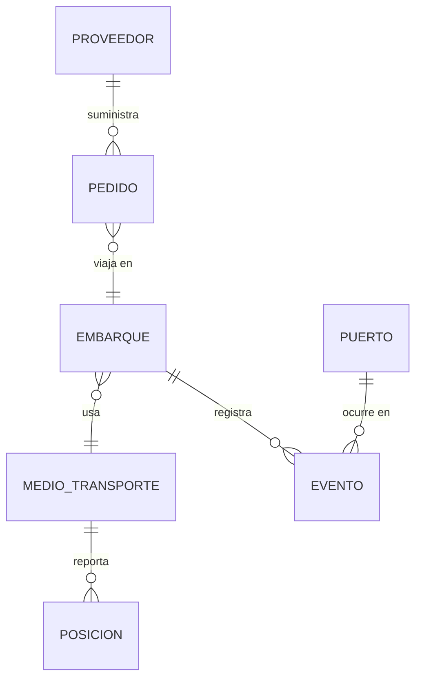

# Modelo de datos

> **Estado: pendiente.** Se completa entre **Sprint 1 y Sprint 2**, a partir
> del análisis de los archivos Excel que hoy usa el área de Compras y de las
> entrevistas con los usuarios.

## Qué falta levantar (Sprint 1)

- [ ] Inventario de campos de los Excel de compras actuales
- [ ] Identificar la llave natural de un pedido (¿número de orden de compra?)
- [ ] Catálogo de proveedores, puertos y aeropuertos involucrados
- [ ] Estados posibles de un pedido y sus transiciones válidas
- [ ] Qué se considera "demora" y contra qué fecha se mide
- [ ] Volumen histórico a migrar y período de retención requerido

## Entidades tentativas

Del anteproyecto. **No implementar hasta validar con el usuario.**

| Entidad | Descripción | Notas |
|---|---|---|
| `pedido` | Orden de compra internacional | Núcleo del modelo |
| `proveedor` | Quién provee la mercancía | |
| `embarque` | Envío físico asociado a uno o más pedidos | Un pedido podría venir partido |
| `medio_transporte` | Buque o aeronave | Discrimina marítimo/aéreo |
| `posicion` | Punto de tracking con timestamp | `GEOGRAPHY(POINT, 4326)`; la tabla que más crece |
| `puerto` | Puerto o aeropuerto | `GEOGRAPHY(POINT, 4326)` |
| `evento` | Hito del ciclo de vida (zarpe, arribo, aduana) | Base del cálculo de estados |

## Diagrama ER

<!-- Reemplazar por el diagrama definitivo al cerrar Sprint 2. -->

## Convenciones acordadas

Ya implementadas en `backend/app/db/base.py`:

- **Nombres de constraints determinísticos** vía `naming_convention` de
  SQLAlchemy. Sin esto, Alembic genera migraciones cuyo `downgrade` no se
  puede aplicar porque desconoce los nombres que puso Postgres.
- **Geometrías en SRID 4326** (WGS84), que es el sistema en que reportan tanto
  AIS como OpenSky. Se usa `GEOGRAPHY` y no `GEOMETRY` para que los cálculos
  de distancia den metros sobre el elipsoide y no grados.
- **Timestamps en UTC** (`TIMESTAMP WITH TIME ZONE`). La conversión a hora de
  Costa Rica se hace en la capa de presentación.

## Migraciones

El esquema se versiona con Alembic. Ver [backend/README.md](../backend/README.md).
